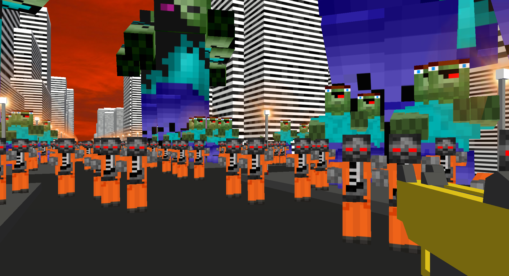

# Final project for Interactive Graphics Course named "Zombie Survival"

The project is first person shooter game.

The player have to kill all the zombies before the time expires and without being eaten by them. Zombies always look for the player and you can't escape them unless they're killed.

The game includes 4 degrees of difficulty and a test modality: the greater the difficulty the harder are the zombies to take down.  

Demo link: https://gabrydx.github.io/ZombieSurvival/index.html or https://sapienzainteractivegraphicscourse.github.io/finalproject-n-team/index.html

Project realized by: Nicolò Mantovani, Gabriele Nicosanti.

=======
# ZombieSurvival
Interactive Graphics project - Zombie Survival - three.js

